# 👩🏻‍💻 Felipe Provençano

**`Estudante acadêmico`**

Me chamo Felipe de Oliveira Provençano, tenho 21 anos e sou natural do Rio de Janeiro. Atualmente, estou cursando Ciência da Computação no CEFET/RJ. Sou apaixonado por tecnologia desde pequeno, gosto muito de aprender novas tecnologias, montar computadores e desenvolver projetos. Meus maiores interesses atualmente são: Desenvolvimento na Linguagem Java, Infraestrutura e Desenvolvimento de Jogos.

---

### 🤖 Linguagens e Tecnologias

 
 

### 📊 Estatísticas

  

